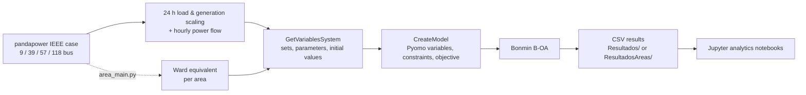
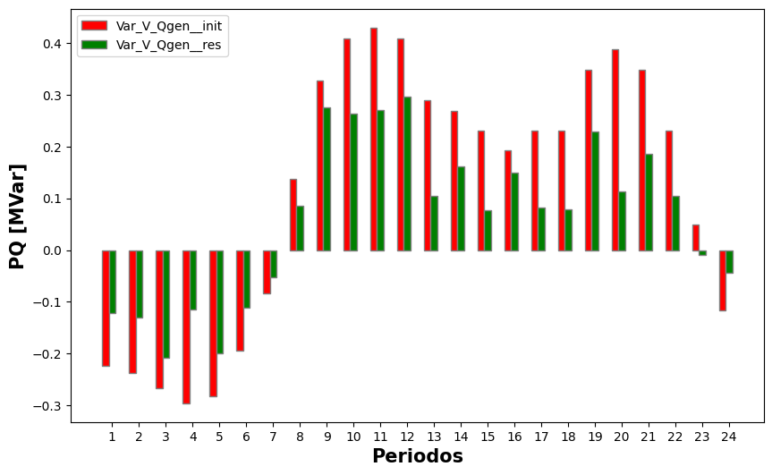
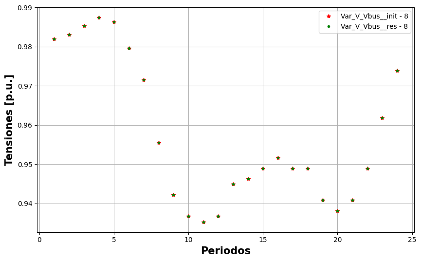
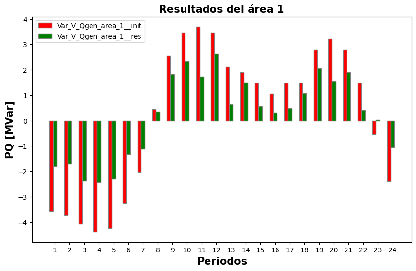

# PowerSystem

**Multi-period (24 h) and multi-area AC optimization models for IEEE test systems, built with Pyomo and pandapower and solved as MINLPs with Bonmin.**


-lightgrey)


---

## Overview

This repository holds the code for a **multi-area, multi-period optimal dispatch** study of power systems. It has two parts:

- **Base model** (`main.py`): builds a 24-hour AC optimization model of the whole network.
- **Multi-area model** (`area_main.py`): splits the network into areas and replaces the rest of the system with a **Ward equivalent** (pandapower `grid_equivalents`), so each area can be optimized separately and compared with the base model.

How a model is built:

1. A standard IEEE case is loaded from `pandapower.networks`.
2. Loads and generation are scaled with a 24-hour profile.
3. An AC power flow is run for each hour. Its results are used to initialize the variables and set some of their bounds.
4. The **Pyomo** model is solved with **Bonmin** (`B-OA` algorithm), because it mixes non-linear AC power-flow equations with integer decisions (shunt steps and transformer ratios).
5. All variables are exported to CSV and analyzed in Jupyter notebooks.



## Optimization Model

**Decision variables** (per hour `t = 1..24`):

| Variable | Description |
|---|---|
| `V_Vbus`, `V_Theta` | Bus voltage magnitude (0.9–1.1 p.u.) and angle |
| `V_LinePij/ji`, `V_LineQij/ji` | Active and reactive line flows in both directions |
| `V_Pgen`, `V_Qgen` | Generator active and reactive power |
| `V_Pslack`, `V_Qslack` | External grid (slack) injections |
| `V_Shunt` | Integer shunt step at selected buses (−10 … 10) |
| `V_Rtrafo` | Integer transformer ratio step (1 … 5) |
| `V_Pd_elastic`, `V_Gs` | Elastic demand and shunt conductance variables |

**Constraints**: apparent power limit on lines, AC active and reactive line-flow equations (polar form with transformer ratio), and active and reactive power balance at each bus.

**Objective** (minimized):

```text
k1 · Σ (V_Shunt[b,t] − V_Shunt[b,t−1])²      → avoid shunt switching between hours
k2 · Σ (V_Vbus[p,t] − V_base[p,t])²           → keep pilot-node voltages close to the base power flow
k3 · Σ V_Qgen[g,t]²                           → reduce generator reactive output
```

with `k1 = 1e-2`, `k2 = 3e+2`, `k3 = 1e+1` for every system.

**Test systems**:

| System | pandapower case | Shunt buses | Pilot nodes | Areas defined in `area_system.py` |
|---|---|---|---|---|
| `ieee9` | `case9()` | 3 | all 9 buses | 2 |
| `ieee39` | `case39()` | 4 | 6 | 3 |
| `ieee57` | `case57()` | 6 | 11 | – |
| `ieee118` | `case118()` | 5 | 16 | – |

## Project Structure

```text
PowerSystem/
├── main.py                      # Base (single-area) 24 h model
├── area_main.py                 # Multi-area model with Ward equivalents
├── requirements.txt
├── LICENSE                      # MIT
├── docs/images/                 # Plots exported from the notebooks
├── _source/
│   ├── system.py                # GetVariablesSystem: data from pandapower (base model)
│   ├── model.py                 # CreateModel: Pyomo model + Bonmin solve + CSV export
│   ├── area_system.py           # Same as system.py, per area (Ward equivalent)
│   ├── area_model.py            # Same as model.py, with Ward border variables
│   ├── main_areas.py            # Electrical-distance clustering (J22, PCoA, K-Means / Fuzzy K-Means)
│   ├── connection.py            # Incidence matrix + cluster connectivity check
│   └── dsbus_dv.py              # dS/dV derivatives (from PYPOWER / pandapower)
├── data analytics/
│   ├── Result_analytics.ipynb       # Plots for the base model results
│   ├── Result_analytics area.ipynb  # Plots for the multi-area results
│   ├── example_pandapower.ipynb     # Ward equivalent examples
│   ├── Pyomo Example.ipynb          # Small Pyomo + Bonmin examples
│   └── main_sep_areas.py            # Jacobian-based area separation experiment
├── gams_script.gms              # GAMS AC OPF with unit commitment (polar) – reference model
├── extract_data_uc.gms          # GAMS data extraction include
├── cost_objective_uc.gms        # GAMS objective include
└── solver/                      # Linux binaries: bonmin, couenne, ipopt
```

## Getting Started

### Prerequisites

- **Linux or WSL**: the solver binaries in `solver/` are Linux ELF executables, and the code calls them with the relative path `solver/bonmin`.
- Python 3.10 (the version used in development).

### Installation

```bash
git clone https://github.com/nensanc/PowerSystem.git
cd PowerSystem
pip install -r requirements.txt
chmod +x solver/bonmin solver/couenne solver/ipopt
```

The notebooks also use `matplotlib`, which isn't in `requirements.txt`.

### Run the base model

1. Pick the system in `main.py` by changing the index (`0` = ieee9, `1` = ieee39, `2` = ieee57, `3` = ieee118):

   ```python
   system = GetVariablesSystem(['ieee9', 'ieee39', 'ieee57', 'ieee118'][0], print_sec=False)
   ```

2. Create the output folder (it is git-ignored) and run from the repository root:

   ```bash
   mkdir -p Resultados/ieee9
   python main.py
   ```

Bonmin writes its log to `bonmin.log`. If the solve succeeds, every variable is saved as `Resultados/<system>/Var_<name>__res.csv`, and the initial power-flow values are saved as `*__init.csv`.

### Run the multi-area model

```bash
mkdir -p ResultadosAreas/ieee9
python area_main.py
```

Results are written to `ResultadosAreas/<system>/` with an `_area_<n>` suffix. Areas (border and internal buses) are only defined for `ieee9` and `ieee39`.

### Analyze results

Open the notebooks in `data analytics/` from that folder. They read the CSVs from `../Resultados/<system>` or `../ResultadosAreas/<system>`. Figures are saved to `../Resultados/Graficas/<system>/` (or `../ResultadosAreas/Graficas/<system>/`), which must exist beforehand.

### Clustering scripts

`_source/main_areas.py` and `data analytics/main_sep_areas.py` write their matrices (J22, attenuation and distance matrices) as CSV files to `Resultados/` at the repository root. Set `POWERSYSTEM_RESULTS_DIR` to use another folder:

```bash
POWERSYSTEM_RESULTS_DIR=/path/to/output python -m _source.main_areas
```

## Results

The plots below come from the committed notebooks and were generated in earlier runs. Each one compares the initial hourly power flow (`__init`) with the optimizer's result (`__res`) over the 24 periods.

| IEEE 9 – generator reactive power | IEEE 9 – pilot-node voltage (bus 8) |
|---|---|
|  |  |

**IEEE 39, multi-area model – generator reactive power in area 1**



## Notes and Limitations

- `area_main.py` currently has `area = 2` fixed and `break` statements in both loops, so a run builds and solves only one area.
- The notebooks build figure file names with Windows path separators (`\`).
- The GAMS files are kept as a reference model. They need GAMS and `.gdx` case files, which aren't in this repository.
- `bonmin.log` and `OsiDefaultName_*` are solver output files from a previous run.
- `_source/create_ward_eq.py` is empty.
- Code comments and console messages are in Spanish.

## Author

**Martin Sanchez** ([@nensanc](https://github.com/nensanc))

## License

This project is licensed under the [MIT License](LICENSE).
